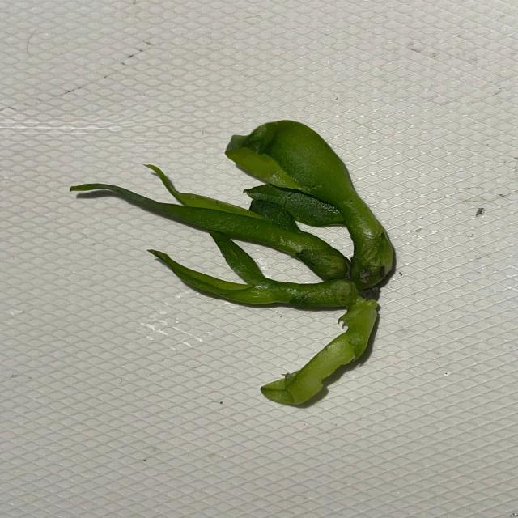
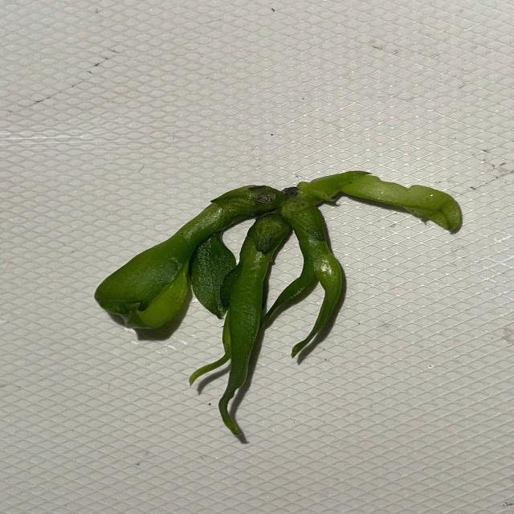
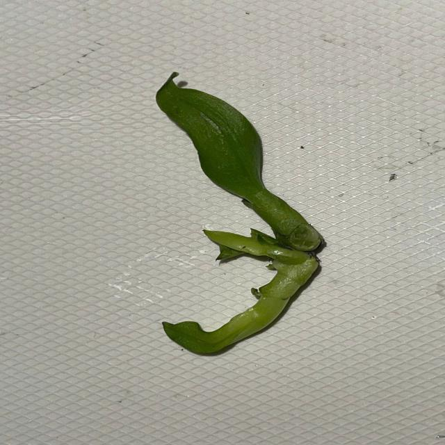
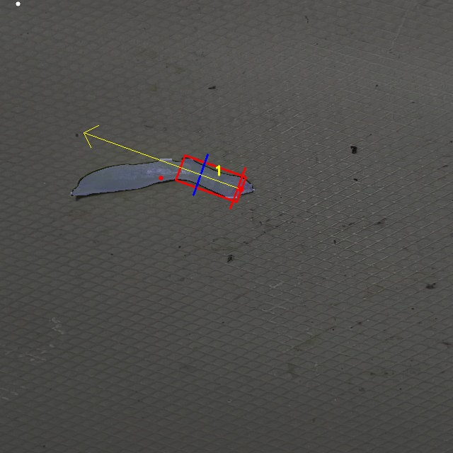

# 🌸 Orchid Bud Detection & Separation with YOLOv8   
🔬 Tách chồi hoa lan tự động với YOLOv8 

---

## 🇺🇸 English Version

### 📌 Project Overview
This project detects and separates orchid buds using:
- YOLOv8 segmentation with TTA (Test-Time Augmentation)
- Oriented Bounding Box (OBB) detection
- Vector-based direction and orchid_bud_invitro separation logic
  
📌 Project PRESENTATION with PIPELINE 👇

https://www.canva.com/design/DAGp2TSzR4A/v7b_Tqwtj_Q-tFWEhDL3Uw/edit?utm_content=DAGp2TSzR4A&utm_campaign=designshare&utm_medium=link2&utm_source=sharebutton

## 📸 Preview: Input vs Output

| Input Image | Output Result |
|-------------|---------------|
|  | .jpg) |
|  | .jpg) |
|  | .jpg) |
| .jpg) |  |


### 🧱 Folder Structure
```
Orchid_project_git/
├── main.py # Main execution file
├── scripts/ # Processing modules (segmentation, vector, draw)
├── models/ # Place 3 pretrained .pt models here
├── data/test_images/ # Sample test images
├── runs/ # Output images (auto-created)
├── requirements.txt
└── README.md
```
### ⚙️ SETUP

```bash
pip install -r requirements.txt
```

### 🧠 Pretrained Models

Put the following models into models/
(download from https://drive.google.com/drive/folders/1XKJg7oOEeHsFCC7VrjzKQfVqJ7QnEdeU?usp=sharing):

- best_seg.pt — segmentation for buds
- best_obb.pt — oriented bounding box detection
- best_segfull.pt — full branch mask


### ▶️ Run the pipeline
```
python main.py
```

Results will be saved to runs/casetest/


### 📌 Author
Developed by hieunp2003
Feel free to fork or star ⭐ if helpful!
